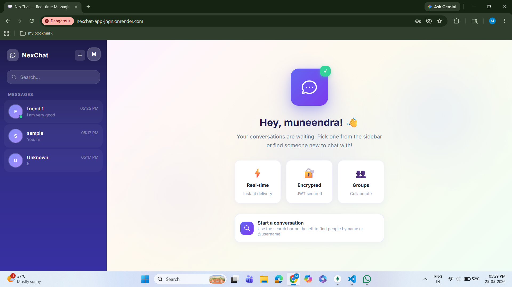
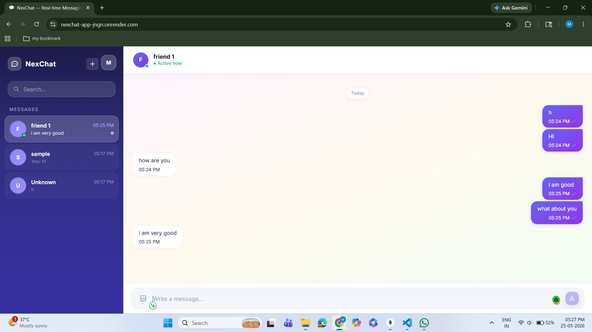
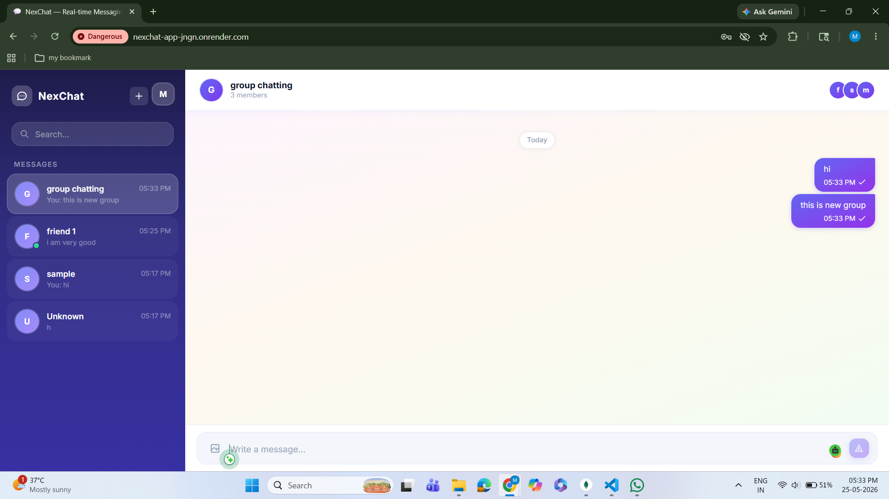
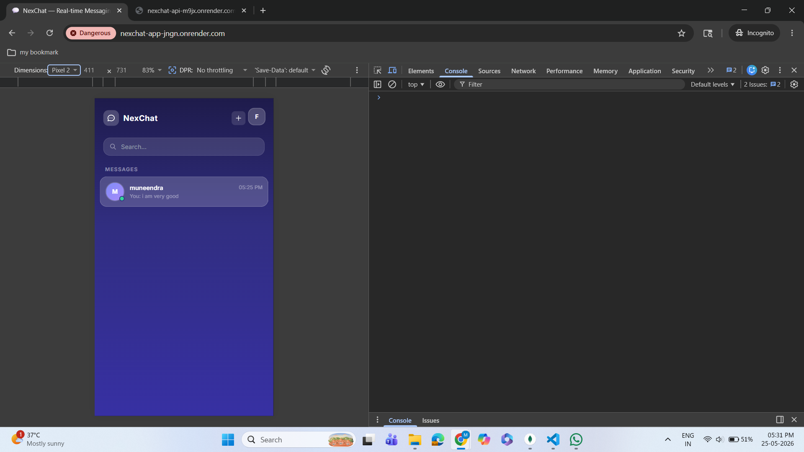

<div align="center">


# 💬 NexChat — Real-time Chat Application

### A full-stack real-time messaging app built with the MERN stack + Socket.io

[](https://nexchat-api-m9jx.onrender.com)
[](https://github.com/munee07/nexchat)



</div>

---

## ✨ Features

| Feature | Description |
|---|---|
| ⚡ Real-time Messaging | Instant messages using Socket.io |
| 👥 Group Chats | Create groups with multiple members |
| 🟢 Online Status | See who's online/offline in real-time |
| ✍️ Typing Indicators | Live "..." bubble when someone types |
| ✅ Read Receipts | Blue tick when messages are seen |
| 😊 Emoji Picker | Full emoji support in messages |
| 📷 Image Sharing | Send images via Cloudinary |
| ❤️ Message Reactions | React to messages with emojis |
| 👤 Profile Management | Update avatar and bio |
| 🔐 JWT Authentication | Secure login with HTTP-only cookies |
| 📱 Mobile Responsive | Works on all screen sizes |
| 🎨 Beautiful UI | Dark sidebar + light chat with gradients |

---

## 🛠️ Tech Stack

**Frontend**
- React 18 + Vite
- Tailwind CSS v3
- Socket.io Client
- Zustand (State Management)
- Axios
- React Router DOM
- React Hot Toast
- Emoji Picker React

**Backend**
- Node.js + Express.js
- Socket.io
- MongoDB + Mongoose
- JWT Authentication
- Bcrypt.js
- Cloudinary (Image Storage)
- Cookie Parser

---

## 📸 Screenshots

<div align="center">

### Auth Page


### Chat Page


### Group Chat


### Mobile View


</div>

---

## 🚀 Getting Started

### Prerequisites
- Node.js v18+
- MongoDB (local or Atlas)
- Cloudinary account

### Installation

**1. Clone the repository**
```bash
git clone https://github.com/YOUR_USERNAME/nexchat.git
cd nexchat
```

**2. Setup Backend**
```bash
cd server
npm install
```

Create `server/.env`:
```env
PORT=5000
MONGO_URI=mongodb://localhost:27017/nexchat
JWT_SECRET=your_jwt_secret
NODE_ENV=development
CLOUDINARY_CLOUD_NAME=your_cloud_name
CLOUDINARY_API_KEY=your_api_key
CLOUDINARY_API_SECRET=your_api_secret
CLIENT_URL=http://localhost:5173
```

**3. Setup Frontend**
```bash
cd ../client
npm install
```

**4. Run the app**

Open two terminals:
```bash
# Terminal 1 - Backend
cd server && npm run dev

# Terminal 2 - Frontend
cd client && npm run dev
```

Open `http://localhost:5173` 🎉
## 📁 Project Structure
```


nexchat/
│
├── client/                     # React + Vite frontend
│   ├── src/
│   │   ├── components/        # Reusable UI components
│   │   ├── context/           # Socket context provider
│   │   ├── hooks/             # Custom React hooks
│   │   ├── pages/             # Application pages
│   │   ├── store/             # Zustand state management
│   │   └── utils/             # Helper functions & utilities
│   │
│   ├── public/                # Static assets
│   ├── package.json
│   └── vite.config.js
│
├── server/                     # Node.js + Express backend
│   ├── config/                # Database & environment configuration
│   ├── controllers/           # Route controller logic
│   ├── middleware/            # Authentication & error middleware
│   ├── models/                # MongoDB/Mongoose models
│   ├── routes/                # API route definitions
│   ├── socket/                # Socket.io real-time handlers
│   ├── utils/                 # Backend utility functions
│   ├── package.json
│   └── server.js
│
├── .env                        # Environment variables
├── README.md
└── package.json
```

## 🌐 API Endpoints

| Method | Endpoint | Description |
|---|---|---|
| POST | `/api/auth/register` | Register new user |
| POST | `/api/auth/login` | Login user |
| POST | `/api/auth/logout` | Logout user |
| GET | `/api/auth/me` | Get current user |
| PUT | `/api/auth/profile` | Update profile |
| GET | `/api/auth/search` | Search users |
| GET | `/api/conversations` | Get all conversations |
| POST | `/api/conversations/private/:userId` | Create private chat |
| POST | `/api/conversations/group` | Create group chat |
| GET | `/api/messages/:conversationId` | Get messages |
| POST | `/api/messages` | Send message |
| PUT | `/api/messages/:id/reaction` | Add reaction |
| PUT | `/api/messages/:conversationId/seen` | Mark as seen |

---

## 🔌 Socket Events

| Event | Direction | Description |
|---|---|---|
| `onlineUsers` | Server → Client | List of online user IDs |
| `newMessage` | Server → Client | New message received |
| `messagesSeen` | Server → Client | Messages marked as seen |
| `reactionUpdated` | Server → Client | Message reaction updated |
| `userTyping` | Server → Client | User started typing |
| `userStopTyping` | Server → Client | User stopped typing |
| `joinConversation` | Client → Server | Join a chat room |
| `typing` | Client → Server | Emit typing status |

---

## 🚀 Deployment

This app is deployed on **Render**:
- **Frontend** → Render Static Site
- **Backend** → Render Web Service
- **Database** → MongoDB Atlas
- **Images** → Cloudinary

---

## 👨‍💻 Author

**Your Name**
- LinkedIn: [your-linkedin](https://www.linkedin.com/in/muneendra-boya/)
- GitHub: [@your-username](https://github.com/your-username)
---

<div align="center">

⭐ **Star this repo if you found it helpful!**

Made with ❤️ using MERN Stack + Socket.io

</div>
